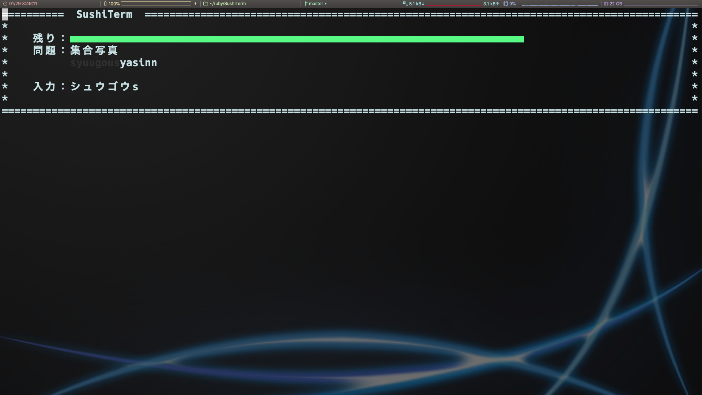

SushiTerm
=========

A tool that allows you to practice typing on the terminal like [寿司打](http://typingx0.net/sushida/).



## Requirement
- Ruby 2.6.5
- romaji gem


## Usage
### Play Game
```sh
$ ruby termtypes.rb
```

## Installation
```sh
$ git clone https://github.com/AtLab-jp/TermTypes
$ cd TermTypes
```
